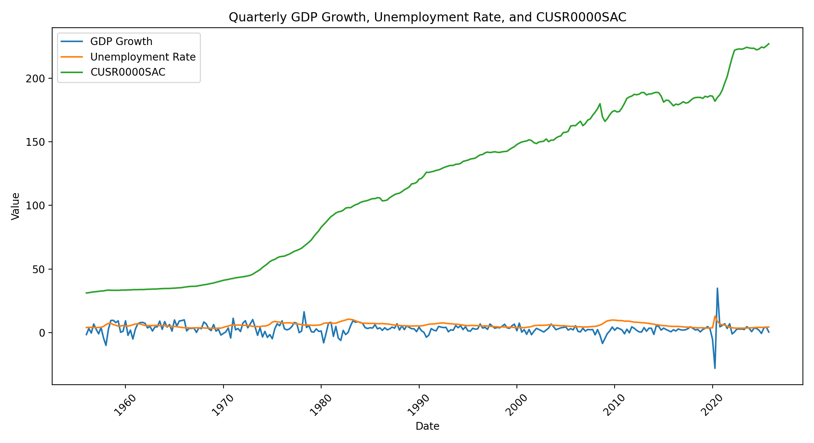
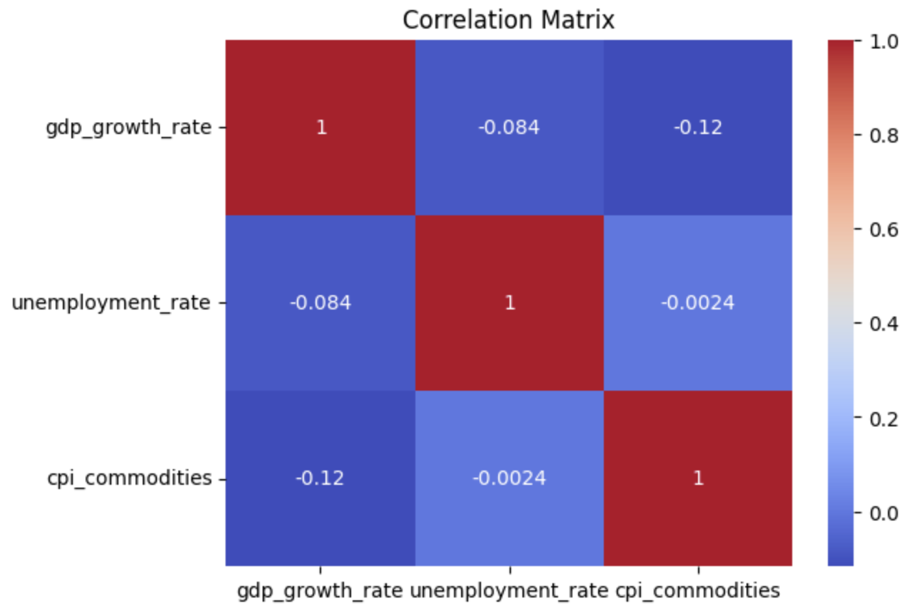

# **Milestone 3: Interim Status Report**

Since our project plan submission, we added an additional dataset, cleaned and merged our datasets, completed exploratory analysis, and created simple baseline models so far. After reading in our data we realized that just having GDP and unemployment rate would be too simple and we wouldn’t have much data to work with, so we also decided to include another dataset, Consumer Price Index for All Urban Consumers: Commodities in the U.S. City Average. This dataset tracks the monthly average price levels of physical goods for U.S. cities, relative to a baseline where prices in 1982-1984 = 100, and it has been seasonally adjusted. It is sourced from the U.S. Bureau of Labor Statistics, published via FRED. It starts from January 1956 to the present. 

After pulling in our 3 datasets, we first cleaned them by checking for missing values, which there were none. We then standardized the time frame column to the ISO 8601 format (YYYY-MM-DD) and made it quarterly as we do not have monthly data for GDP. We then integrated our datasets together through tools from the Pandas library in Python on our timeframe column. Here is a simple graph of our data before scaling and other operations. 

As you can see there are spikes for all 3 variables in 2020 due to the COVID-19 pandemic. We decided to add a dummy variable to indicate covid quarters which we marked for these quarters '2020-04-01', '2020-07-01' so that our models can account for it rather than erase it. We didn’t want to erase it because it is a real world event and it may give important indicators for patterns during periods of recession. However, here is where we ran into a challenge. Because our data is limited in size, we would only have 2 quarters with the dummy variable for covid, so it wouldn’t be feasible to train our data with the covid dates and make any predictions in the future/present when covid isn’t happening and vice versa(training on no covid and predicting during covid) so we ultimately decided to remove the covid quarters completely. 

We also created a correlation heatmap. We also standardized our data so not one variable dominates our model’s prediction. 

We will try multiple different types of models including linear regression (simple and lagged), tree-based models including Random Forest and XGBoost, and time series models such as ARIMA models. We will first start with just using the mean as a baseline model so we can compare how well our model performs compared to this baseline.

 From just the simple unemployment rate mean, we get an unemployment rate of 5.79% with an RMSE of 1.61 percentage points. This means that our models that we build should have an RMSE of at least below 1.61 percentage points to know that our model is giving any predictive power at all. 

For linear regression we first set the most recent 15% of our data to be our test set. It is critical that we do not randomly set aside data for our test set in this situation because we are developing a model for time series data and we would like to use past data to predict present/future data so it makes most sense to keep the most recent data for testing. For our case our training data ends at 2015-04-1 and the testing set begins at 2015-07-01. 

After scaling our data we fit our model to a simple linear regression using our X variables and got a RMSE value of 2.66 above our baseline and a negative r squared. This means there is something severely wrong with our model and we must examine further. After examining further we realized that the consumer prices index was dominating our prediction which only made our prediction positive as CPI is a long term positive trend. We forgot that we must difference all our data in time series analysis. So we differenced our CPI data and refit the model for the following results: RMSE of 0.53, R^2: -0.054however our r squared is still negative. We believe the reason for this is because we did not introduce lagged variables. For time serieses it is important to include lagged versions of variables to see if there are lagging or leading variables that can help with predicting power. 

So now we fit a new model with lagged X features as well as a lagged version of unemployment itself. This gave us results: RMSE: 0.53, R^2: -0.0401. So our model slightly improved but it is still worse than just the average baseline model R^2 wise. After this we decided on for the next steps: We will only use data dating back to 1990 and forward as we are currently using data all the way from 1956 currently. And we will also try different models to see if we can achieve better performance. 

## Comments for milestone 2: 

Changes in project plan based on feedback given in Project plan Milestone 2. Since then, both partners committed files to the repo. For project plan milestone 2 we both worked on the document however only one partner submitted the file into Github. For milestone 3 we both created contributions to the dataset by cleaning, merging and analyzing the data and building off each other's work.

As for dataset integration, we clearly stated how GDP, Unemployment rate and Inflation affect each other. And the reasoning why we decided to move forward with these datasets. 

New data:
https://fred.stlouisfed.org/series/CUSR0000SAC 
